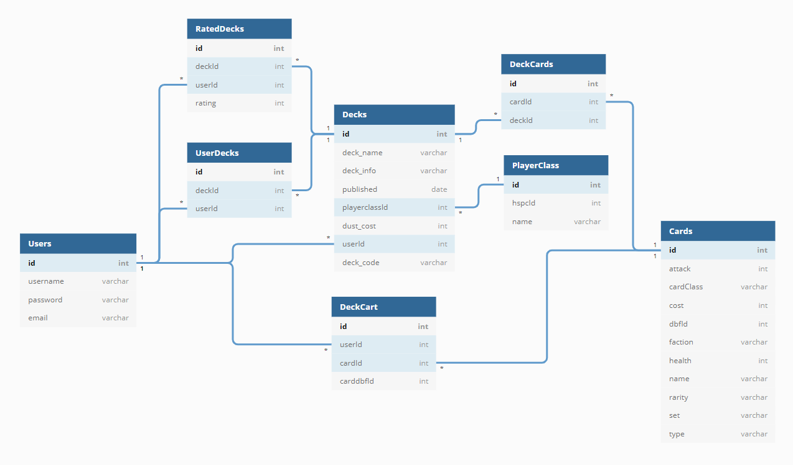

# The Deck Tavern

The Deck Tavern was created to allow gamers in the Hearthstone community to easily create, view, and share card decks with other players. It provides unlimited space for saved decks to remove the constraint of the 15 deck limit in the client itself. Here's a breakdown of what you can do as a user:

### Deck Creators (anyone can create them!)
* Choose a hero class that the deck will be based on
* Create a 30 card deck with game rules built-in to avoid any mistakes
* View saved decks that you created
* Delete any saved decks that you created
* Access the deck code that was generated on the decks to import it right to the game!

### General Users
* View all created decks and sort them by rating, date, and users who created them
* Rate decks that other players have created to help the best rise to the top
* Copy the deck code from any created deck to import and try it out in the game client
* Visit the profile of a deck creator to see all other decks they created

## See It In Action

GIFs coming soon!

## Technologies Used

* React
* MDBootstrap
* React-strap
* Google Developers Charts
* JSON Server
* HearthSim API

## Running The App

In order to get The Deck Tavern running locally please do the following in your terminal:

### `git clone git@github.com:rryb77/deck-tavern-capstone.git`

Once you've cloned the repo cd into the directory and use the following command to install the needed libraries and dependencies this app uses:

### `npm install`

This project also relies on the JSON database running on port 8088 which can be found here:

### `git clone git@github.com:rryb77/deck-tavern-api.git`

Once everything is installed use the following command to run it:

### `npm start`

## ERD

